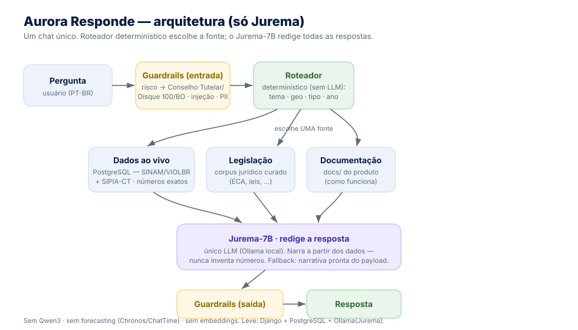

# Arquitetura — Aurora Responde

O Aurora Responde é um **chat único** sobre violência contra crianças e
adolescentes. Diferente do Projeto Aurora original (que usava o Qwen3 como
orquestrador de *tool-calling* e modelos de série temporal), este fork tem **um
só LLM — o Jurema-7B** — que redige **todas** as respostas. A escolha da fonte
é feita por um **roteador determinístico** (código, não LLM).

## Fluxo de uma pergunta

1. **Guardrails (entrada)** — antes de qualquer coisa: se há indício de risco a
   uma criança, responde com os encaminhamentos (Conselho Tutelar / Disque 100 /
   Boletim de Ocorrência) **sem** chamar o LLM; detecta injeção de prompt; mascara
   PII (CPF/CNPJ/CNS).
2. **Roteador determinístico** — detectores de texto decidem o **tema**
   (dados / legislação / SIPIA-CT / produto), o **nível geográfico** (Brasil / UF /
   município), o **tipo de violência**, se é **ranking** ou **comparação**, e o
   **ano**. Parte de um default (`relatorio_brasil`) e refina com esses detectores.
3. **Uma ferramenta roda** (sem LLM escolhendo):
   - **dados** → `relatorio_brasil` / `relatorio_uf` / `relatorio_municipio` /
     `ranking_municipios` (SQL ao vivo no PostgreSQL — números exatos);
   - **legislação** → `rag_juridico` (corpus de leis curado em
     [`leis_corpus.py`](../webapp/chats/series_temporais/orquestrador/leis_corpus.py));
   - **SIPIA-CT** → `consulta_sipia_ct` (view `sipiact.vw_sipiact_long`);
   - **produto** → `rag_interno` (busca por palavra-chave nos `docs/*.md`).
4. **Jurema redige** — `_narrar_com_jurema` monta o prompt a partir do payload
   humanizado (que já traz uma `narrativa_sugerida` pronta) e chama o Jurema-7B
   (`ollama.generate`). O modelo **nunca inventa números** — narra o que a
   ferramenta retornou. Se o Jurema estiver indisponível, há *fallback* para a
   `narrativa_sugerida`, garantindo sempre uma resposta.
5. **Guardrails (saída)** — última checagem antes de devolver ao usuário.

## Camadas (código)

| Camada | Onde | Responsabilidade |
|--------|------|------------------|
| Web | `webapp/` (Django 6) | Views do chat, templates, autenticação, sessão. |
| Orquestração | `webapp/chats/series_temporais/orquestrador/orchestrator.py` | Roteador determinístico (`_route_category`, `_maybe_*`, `_enforce_*`, `_extract_year_filter`) + narração (`_narrar_com_jurema`). |
| Ferramentas | `.../tools.py`, `.../rag_tools.py`, `.../sipia_ct.py`, `.../leis_corpus.py` | Consultas SQL, RAG jurídico/interno, SIPIA-CT. |
| Camada semântica | `webapp/sinam/` | Modelo `Notificacao` + filtros geo/violência (ver [semantic_layer.md](semantic_layer.md)). |
| Dados | `src/db.py` + PostgreSQL | Conexão `psycopg`, séries e agregações SQL ao vivo. |
| LLM | Ollama local | **Jurema-7B** — único modelo generativo. |
| Segurança | `webapp/guardrails/` | Risco, injeção, PII, limites de uso. |

## Um único banco: PostgreSQL

Todo o estado (usuários, conversas) e os dados (SINAM/VIOLBR + SIPIA-CT) vivem
no mesmo PostgreSQL definido no `.env` (variáveis `PG*`). Ver
[database.md](database.md).

## O que NÃO existe mais neste fork

- **Qwen3 como orquestrador** — substituído pelo roteador determinístico.
- **Forecasting** (Chronos-2, ChatTime, `src/analytics`, `src/series_models`) —
  relatórios passam a ser **SQL puro** (totais por ano, rankings, séries).
- **Embeddings** (pgvector, sentence-transformers) — o RAG é por palavra-chave.
- **Apps extras** (analise, benchmark, dados_sinam, datas_comemorativas, mapas).
