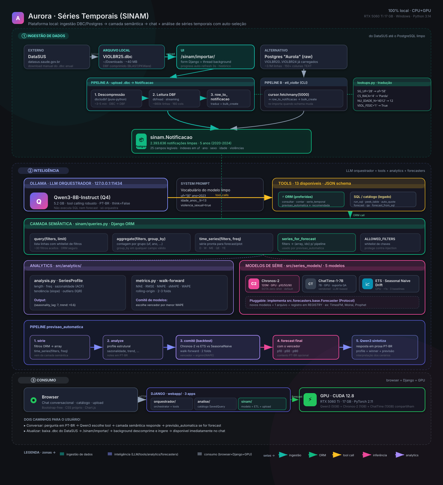

# Arquitetura



Plataforma de IA conversacional sobre dados SINAM/VIOLBR. O LLM local atua
como **orquestrador** (não como motor de previsão) e tem acesso a 11
ferramentas, entre elas o pipeline `auto_forecast` que analisa a série, roda
backtest comparativo, escolhe o melhor modelo e devolve a previsão final
com métricas e intervalos de confiança.

## Camadas

### `src/analytics/` — análise estrutural e backtest

Reutilizável, sem dependência de Django. Duas APIs:

| Função                        | Para que serve                                          |
|-------------------------------|---------------------------------------------------------|
| `analyze_series(values, idx)` | Profile (length, freq, sazonalidade, tendência, outliers). |
| `walk_forward_backtest(...)`  | Walk-forward com N folds; retorna MAE/RMSE/MAPE/WAPE.   |
| `metrics(y_true, y_pred)`     | Métricas de erro em uma chamada.                        |

### `src/series_models/` — 5 modelos pluggable

| Chave            | Backend                | Características                        |
|------------------|------------------------|----------------------------------------|
| `chronos2`       | Amazon Chronos-2 (HF)  | 120M, GPU, p10/p50/p90 calibrados      |
| `chattime`       | Vendored ChatTime-1-7B | 7B, GPU, suporta QA                    |
| `ets`            | statsmodels HW         | <1MB, CPU, ms                          |
| `seasonal_naive` | Próprio (numpy)        | trivial mas vence muito                |
| `drift`          | Próprio (numpy)        | linear baseline                        |

Todos implementam o mesmo Protocol [`Forecaster`](../src/series_models/base.py).
Adicionar TimesFM/Moirai/Prophet é criar um adapter e registrar no `REGISTRY`.

### `src/` — núcleo (sem Django)

Reusável tanto pela CLI quanto pela web app.

| Módulo                    | Responsabilidade                                              |
|---------------------------|---------------------------------------------------------------|
| `src/db.py`               | Pool de conexão `psycopg`, helpers de query, série temporal.   |
| `src/chattime_runner.py`  | Wrapper singleton que carrega o ChatTime sem `device_map="auto"` (evita `OSError 1455` no Windows). Expõe `predict` e `analyze_verbose`. |
| `src/main.py`             | CLI argparse (subcomandos `ping`, `tables`, `describe`, `query`, `forecast`, `ask`). |

### `webapp/` — interface Django

| Pasta                     | Responsabilidade                                              |
|---------------------------|---------------------------------------------------------------|
| `webapp/sinamweb/`        | `settings.py` (carrega `.env` da raiz), `urls.py`.            |
| `webapp/forecasts/`       | App único: modelos, views, services, forms, urls, admin.     |
| `webapp/forecasts/services.py` | Cola entre views Django e `src/`; converte exceções em campos `error`. |
| `webapp/templates/`       | Templates server-rendered (Bootstrap + Chart.js).             |
| PostgreSQL `Aurola`       | Banco do Django (ORM): `auth_user`, `SavedQuery`, `ForecastRun`, `QARun`, conversas dos chats, `sinam_notificacao` e embeddings. Ver "Um único banco" abaixo. |

### Um único banco: PostgreSQL

Desde a consolidação, **todo o projeto usa um só banco** — o PostgreSQL
definido no `.env` (variáveis `PG*`, o mesmo `Aurola` lido pela CLI em
`src/db.py`). Ali ficam tanto os dados SINAM (`VIOLBR*` brutos e o
`sinam_notificacao` limpo) quanto o estado da aplicação (usuários, consultas
salvas, histórico de forecast/QA e as conversas dos chats).

O SQLite (`webapp/db.sqlite3`) é apenas um **legado** mantido para backup; os
dados foram copiados para o Postgres com `manage.py migrate_sqlite_to_pg`.

## Fluxo de uma execução de forecast

1. Usuário escolhe uma `SavedQuery` na UI e submete o form `ForecastForm`.
2. `views.run_forecast_view` chama `services.run_forecast(...)`.
3. `services` → `src.db.time_series(sql)` → DataFrame → `np.ndarray`.
4. `services` → `ChatTimeRunner.get(...).predict(history, context)`.
   - 1ª chamada: carrega o modelo de `~/.cache/huggingface` (vários min em CPU).
   - Próximas: usa o singleton já em memória.
5. Resultado serializado em `ForecastRun` (JSON fields: history/predicted).
6. Redirect para `forecast_detail` — template renderiza Chart.js com história
   + previsão sobreposta.

## Singleton do modelo

`ChatTimeRunner` mantém uma instância de classe (`_instance`). Em produção,
configure o gunicorn com **1 worker** para garantir que a memória seja
compartilhada:

```bash
gunicorn sinamweb.wsgi --workers 1 --timeout 600
```

Múltiplos workers carregariam o modelo várias vezes (~13 GB cada) e degradariam
desempenho sem necessidade — todas as inferências aqui são sequenciais por
natureza.
