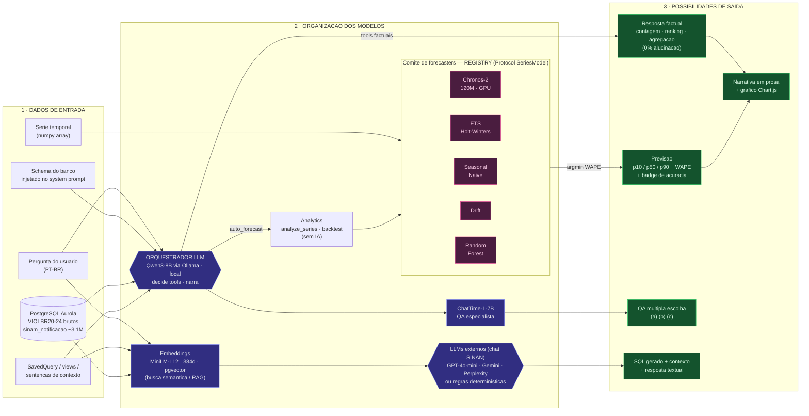
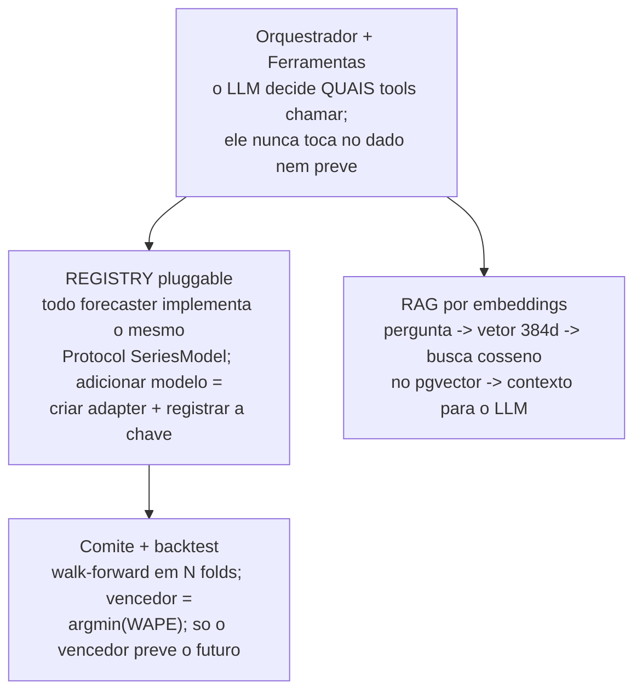

# Diagrama das funcionalidades dos modelos (alto nível)

Visão transversal de **todos os modelos** da plataforma Aurora, organizada em
três eixos:

1. **Dados de entrada** — o que cada modelo consome.
2. **Estratégia de organização** — como os modelos são coordenados (orquestrador
   + ferramentas, comitê pluggable, RAG, seleção por métrica).
3. **Possibilidades de saída** — o que cada caminho devolve ao usuário.

> Este documento é o mapa conceitual. Para o detalhe do fluxo do chat de séries
> temporais veja [`models_roles.svg`](models_roles.svg); para as camadas de
> código veja [`arquitetura.md`](arquitetura.md).

---

## 1. Visão geral — Entrada → Organização → Saída

Imagem: [`modelos_diagrama.svg`](modelos_diagrama.svg) (vetorial) ·
[`img/modelos_diagrama.png`](img/modelos_diagrama.png) (alta resolução, para
slides). Fonte editável abaixo (Mermaid).

**Regra de ouro do pipeline de previsão:** se o `WAPE` do modelo vencedor > 25 %,
desconfie da previsão — mesmo o melhor candidato errou mais de 1/4 do volume no
backtest.

---

## 2. Dados de entrada por modelo

| Modelo / componente        | Entrada                                                             | Formato          |
|----------------------------|--------------------------------------------------------------------|------------------|
| Orquestrador (Qwen3-8B)    | Pergunta PT-BR + schema pré-injetado + resultado JSON das tools     | texto / JSON     |
| LLMs externos (chat SINAN) | Pergunta PT-BR + contexto RAG (top-8) + schema da view              | texto            |
| Embeddings (MiniLM-L12)    | Texto (pergunta, sentenças de contexto, SavedQuery)                 | string → vetor 384d |
| Chronos-2 / ETS / baselines| Série temporal histórica (`numpy array`) + horizonte                | array numérico   |
| Random Forest              | Série + defasagens (lags) engenheiradas                             | array + features |
| ChatTime-1-7B (QA)         | Série + pergunta de múltipla escolha em linguagem natural           | array + texto    |
| Analytics (sem IA)         | Série + índice de datas + dica de frequência                        | array + índice   |

Origem dos dados: um **único banco PostgreSQL `Aurola`** — tabelas brutas
`VIOLBR20..24`, a tabela limpa `sinam_notificacao` (~3.1M notificações), as
`SavedQuery`, os embeddings e o histórico de conversas.

---

## 3. Estratégia de organização

Quatro padrões coordenam os modelos:

- **Orquestrador + Ferramentas** — o Qwen3 lê a pergunta, escolhe entre 11 tools
  (factuais, análise, previsão, QA) e narra o resultado. Separa *decisão* de
  *execução*: consultas factuais vêm 100 % do banco (zero alucinação).
- **REGISTRY pluggable** ([`src/series_models/__init__.py`](../src/series_models/__init__.py)) —
  os forecasters são intercambiáveis atrás do Protocol
  [`SeriesModel`](../src/series_models/base.py). Trocar/adicionar TimesFM, Moirai
  ou Prophet é criar um adapter e registrar a chave.
- **Comitê + backtest** — o pipeline `auto_forecast` analisa a série, roda o
  backtest walk-forward de vários candidatos e elege o de menor `WAPE`.
- **RAG por embeddings** — o chat de dados SINAN vetoriza a pergunta, busca as
  sentenças mais próximas no pgvector e injeta esse contexto no LLM que gera o
  SQL/resposta.

Padrão de carregamento: **singleton** por modelo (os pesos ficam em memória e são
reaproveitados entre requisições).

---

## 4. Possibilidades de saída

| Caminho                    | Saída                                                              | Quem produz                        |
|----------------------------|-------------------------------------------------------------------|------------------------------------|
| Consulta factual           | Contagem, ranking, agregação — direto do banco                    | ORM / SQL (sem IA)                 |
| Previsão automática        | Séries `p10 / p50 / p90`, `WAPE` + ranking + badge de acurácia    | Comitê → vencedor (Chronos-2/ETS…) |
| QA múltipla escolha        | Resposta `(a) / (b) / (c)`                                         | ChatTime-1-7B                      |
| Diagnóstico estrutural     | `SeriesProfile` (tendência, sazonalidade, outliers, notas PT-BR)  | Analytics                          |
| Chat SINAN (NL→SQL)        | SQL gerado + tabela de resultados + resposta textual              | Embeddings + LLM externo/regras    |
| Narrativa final            | Prosa + gráfico Chart.js sobrepondo histórico e previsão          | Orquestrador                       |

Badge de acurácia (derivado do `WAPE` do vencedor): **alta** < 10 % · **boa**
< 25 % · **média** < 50 % · **baixa** > 50 %.

---

## Resumo em uma frase

Um **orquestrador LLM local** decide o caminho; **consultas factuais** vêm
direto do banco; um **comitê pluggable de modelos de série temporal** é testado
em backtest e o melhor por `WAPE` faz a previsão com intervalos; o **ChatTime**
responde perguntas de múltipla escolha; e um **modelo de embeddings** alimenta o
RAG do chat de dados SINAN — tudo sobre um único PostgreSQL.
