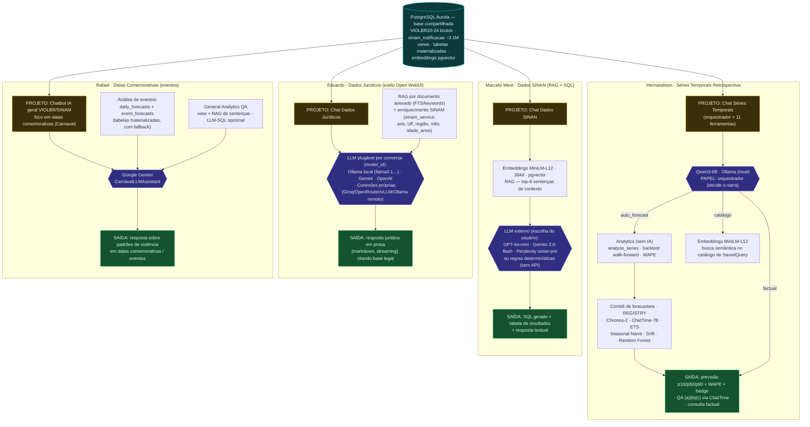

# Modelos e projetos por pesquisador

Visão **por pessoa** — destacando o projeto (chat) de cada pesquisador, os
modelos que cada um usa e o tipo de saída. Todos compartilham a mesma base de
dados (PostgreSQL `Aurola`).

> Complementa o diagrama transversal em [`modelos_diagrama.md`](modelos_diagrama.md)
> (entrada → organização → saída). Dono de cada chat vem do campo `owner` do
> `ChatType` registrado em cada `apps.py`.

Imagem: [`modelos_por_pesquisador.svg`](modelos_por_pesquisador.svg) (vetorial)
· [`img/modelos_por_pesquisador.png`](img/modelos_por_pesquisador.png) (alta
resolução). Fonte editável (Mermaid) abaixo.

---

## Diagrama

---

## Tabela-resumo

| Pesquisador     | Projeto (app Django)        | Modelos usados                                                                                           | Entrada                                   | Saída                                                        |
|-----------------|-----------------------------|----------------------------------------------------------------------------------------------------------|-------------------------------------------|-------------------------------------------------------------|
| **Hernandison** | `series_temporais`          | Qwen3-8B (orquestrador) · Chronos-2 · ChatTime-7B · ETS · Seasonal Naive · Drift · Random Forest · Embeddings MiniLM · Analytics | Pergunta PT-BR + série temporal (Postgres) | Previsão `p10/p50/p90` + WAPE · QA `(a)(b)(c)` · factual     |
| **Marcelo West**| `dados_sinam`               | Embeddings MiniLM (RAG/pgvector) · GPT-4o-mini / Gemini 2.0-flash / Perplexity sonar-pro (ou regras)     | Pergunta PT-BR + contexto RAG + schema     | SQL gerado + tabela + resposta textual                      |
| **Eduardo**     | `dados_juridicos`           | LLM por conversa: Ollama local (llama3.1…) / Gemini / OpenAI / conexões próprias · RAG de documentos     | Pergunta + documentos anexados + SINAM     | Resposta jurídica em prosa (markdown, streaming) c/ base legal |
| **Rafael**      | `datas_comemorativas`       | Google Gemini (`CarnavalLLMAssistant`) · análise de eventos (forecasts) · General Analytics QA           | Pergunta + previsões de eventos + views    | Resposta sobre padrões em datas comemorativas / eventos     |

Todos leem e escrevem no **mesmo PostgreSQL `Aurola`**. As diferenças estão na
**estratégia de cada projeto**: Hernandison orquestra um comitê de modelos de
série temporal; Marcelo faz NL→SQL com RAG e LLM externo; Eduardo oferece um chat
plugável (qualquer LLM) com RAG de documentos; Rafael foca análise de eventos com
Gemini.
