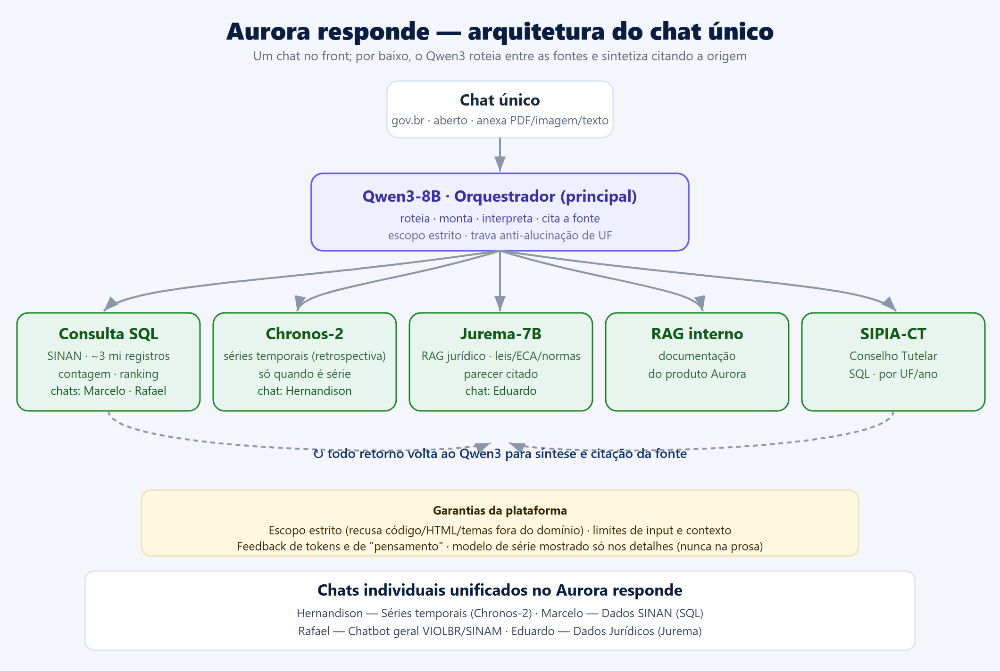
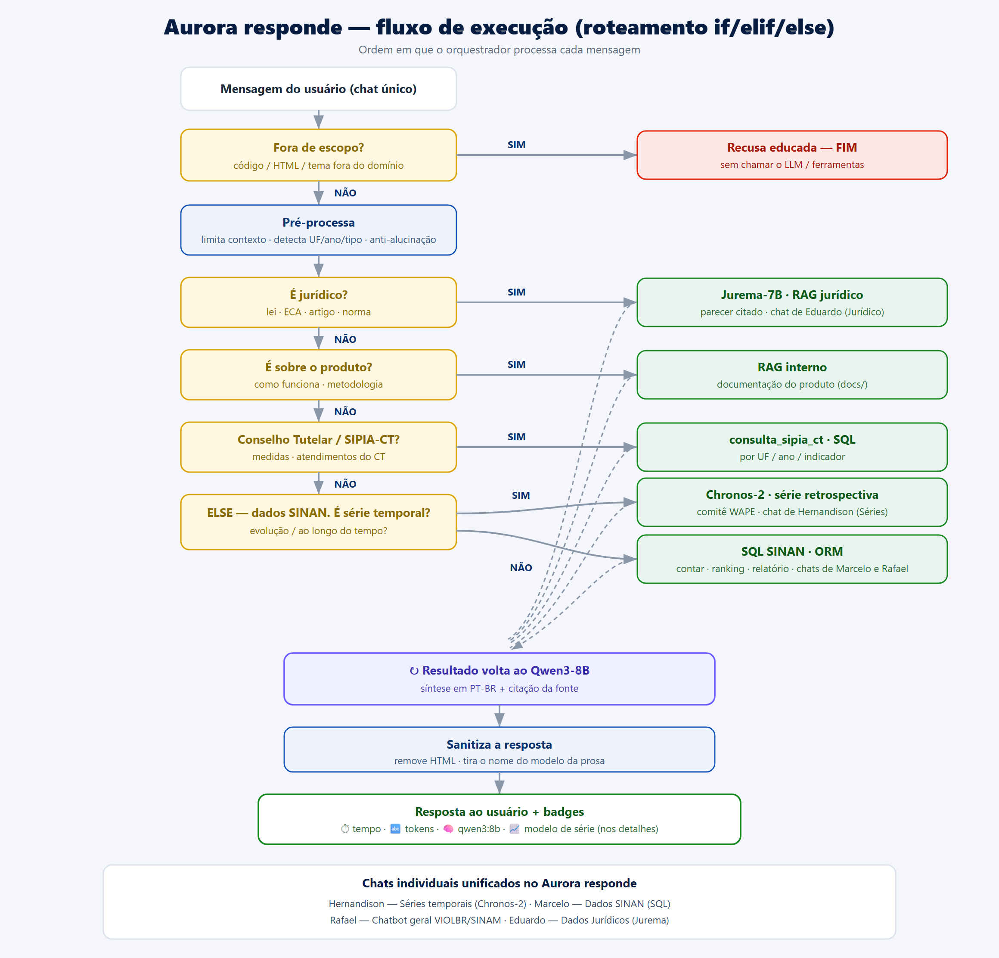
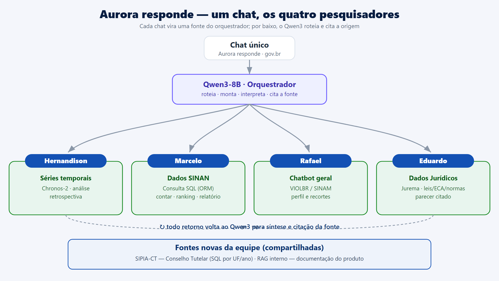

# Aurora responde — unificação dos chats

**Branch:** `feat/aurora-responde-unificado`
**Objetivo:** um único chat no front-end; por baixo, o mesmo orquestrador Qwen3
roteia entre várias fontes (SQL, séries, jurídico, docs) e sintetiza a resposta
**citando a fonte**.

> "No front o chat é um só, mas por trás tem toda essa interação."

```
              ┌──────────────┐
              │  Chat único  │  (front: "Aurora responde")
              └──────┬───────┘
                     ▼
              ┌──────────────┐
              │   Qwen3-8B   │  roteia, monta e interpreta
              └──────┬───────┘
        ┌────────────┼─────────────┬──────────────┐
        ▼            ▼             ▼              ▼
   Consulta SQL   Chronos-2    RAG jurídico    RAG interno
   SINAN/SIPIA-CT  séries      leis/normas     docs produto
                                (Jurema)
        └────────────┴─────────────┴──────────────┘
                     ▲
        ↻ todo retorno volta ao Qwen3 p/ síntese + citação da fonte
```

## Diagramas

**v1 — arquitetura (conceitual):** o chat único → Qwen3 → as 5 fontes.



**v2 — fluxo de execução (roteamento if/elif/else):** a ordem em que o
orquestrador processa cada mensagem (escopo → roteador → ferramenta → volta ao
Qwen3 → sanitiza → resposta).



**v3 — um chat, os quatro pesquisadores:** cada chat com o nome do responsável
(Hernandison · Marcelo · Rafael · Eduardo) + as fontes novas da equipe.



Fontes vetoriais (editáveis): [v1](aurora_responde_arquitetura.svg) ·
[v2](aurora_responde_arquitetura_v2.svg) · [v3](aurora_responde_arquitetura_v3.svg).

---

## 1. Por que "estender o orquestrador" (e não um app novo)

O bloco central do diagrama **já existe** e está calibrado:
[orchestrator.py](../webapp/chats/series_temporais/orquestrador/orchestrator.py) é
um loop de tool-calling com `qwen3:8b` (via Ollama, com fallback para LLMs
externos) que já cobre **Consulta SQL (SINAM)** e **Chronos-2 (séries)**. Recriar
isso num app novo seria reescrever o mais difícil. A decisão foi **estender**: a
UI passa a ser uma só ("Aurora responde") e o orquestrador ganha as fontes que
faltam como **novas tools**.

Os 4 chats de hoje (um por pesquisador):

| Chat | App | Vira, no Aurora responde… |
|---|---|---|
| Séries Temporais (Hernandison) | `series_temporais/orquestrador` | **o núcleo** (Qwen3 + SQL + Chronos-2) |
| Dados SINAN (Marcelo West) | `dados_sinam` | absorvido pelas tools SINAM |
| Chatbot geral (Rafael) | `datas_comemorativas` | absorvido / aposentado |
| Dados Jurídicos (Hernandison) | `dados_juridicos` | vira a tool `rag_juridico` (Jurema) |

---

## 2. O que já foi feito nesta branch (scaffold)

- **Novas tools** em
  [rag_tools.py](../webapp/chats/series_temporais/orquestrador/rag_tools.py),
  registradas no conjunto único de tools em
  [tools.py](../webapp/chats/series_temporais/orquestrador/tools.py):
  - `rag_juridico(query, limit)` — reusa o full-text jurídico de
    [dados_juridicos/retrieval.py](../webapp/chats/dados_juridicos/retrieval.py).
    **Funciona hoje** (se a tabela jurídica estiver populada).
  - `rag_interno(query, limit)` — busca por palavra-chave em `docs/*.md`.
    **Funciona hoje** (13 arquivos indexados on-the-fly, sem embeddings).
  - `consulta_sipia_ct(filtros, group_by)` — **stub** que degrada com mensagem
    clara até a base SIPIA-CT ser plugada.
- **System prompt**: addendum "Aurora responde" (`AURORA_ADDENDUM` em
  [orchestrator.py](../webapp/chats/series_temporais/orquestrador/orchestrator.py))
  ensinando o roteamento entre fontes e a **citação obrigatória** de `rag_*`.
  É aditivo — as regras de séries/SINAM continuam valendo.
- **UI**: rename para "Aurora responde" nos templates
  [thread.html](../webapp/templates/chat/thread.html) e
  [thread_list.html](../webapp/templates/chat/thread_list.html).

Nada disso quebra os chats existentes: as tools novas são apenas adicionadas ao
loop; se uma fonte não estiver configurada, ela responde "indisponível" sem
levantar exceção.

---

## 3. Roadmap de implementação

### Fase 1 — Roteamento e grounding (base do scaffold) ✅ iniciada
- [x] Tools `rag_juridico` / `rag_interno` / `consulta_sipia_ct` no loop.
- [x] Addendum de roteamento + citação no system prompt.
- [x] UI renomeada.
- [ ] **Validar o benchmark** ([tests/benchmark](../tests/benchmark)) — garantir
  que as novas tools não fazem o Qwen3 desviar em perguntas de séries. Rodar
  `benchmark_run` e comparar as notas do juiz antes/depois.
- [ ] Ajustar `_humanize_result_for_llm` para os payloads das tools `rag_*`
  (hoje caem no shrink default — funciona, mas dá pra enxugar).

### Fase 2 — RAG jurídico de verdade (a "versão do Jurema")
- [ ] Definir a base legal: hoje é FTS na tabela `sentencas_violencia_chatbot`
  (sentenças). Para **leis e normas** (ECA, portarias, resoluções CONANDA),
  precisamos de um corpus legal indexado. Opções: (a) tabela nova
  `normas_juridicas` com FTS `portuguese`; (b) embeddings (pgvector) para
  busca semântica.
- [ ] Decidir se o **Jurema** (LLM jurídico) entra como **gerador** de uma etapa
  jurídica ou se o Qwen3 continua sintetizando sobre os trechos recuperados.
  Recomendado começar com Qwen3 sintetizando (menos infra) e medir.
- [ ] Config: `JURIDICO_RAG_TABLE` / `JURIDICO_RAG_COLUMN` já existem — apontar
  para o corpus legal quando pronto.

### Fase 3 — SIPIA-CT como fonte SQL
- [ ] Modelar a base do Conselho Tutelar (schema, ETL de carga).
- [ ] Implementar `tool_consulta_sipia_ct` reusando a camada segura de
  `sinam.queries` (whitelist de filtros) — contrato análogo a `consultar/contar`.
- [ ] Config: `SIPIA_CT_TABLE` no `.env`.

### Fase 4 — RAG interno robusto
- [ ] Indexar `docs/` (e docs de produto adicionais) com chunking + embeddings
  em vez do keyword-match atual, se a qualidade exigir.
- [ ] Config: `AURORA_DOCS_DIR` (já suportado; default = `docs/` da raiz).

### Fase 5 — Consolidação da UI e aposentadoria dos chats antigos
- [ ] "Aurora responde" vira a entrada principal da home
  ([home.html](../webapp/core/templates/core/home.html)).
- [ ] Redirecionar `dados-sinam` / `chatbot` / `dados-juridicos` para o chat
  único (ou marcá-los como legado) — decisão com os pesquisadores donos.
- [ ] Mostrar na UI **qual fonte** respondeu (chip por tool) e as citações.

---

## 4. Citação de fonte (contrato)

Cada tool `rag_*` retorna `fonte` + `trechos[{ref, texto, ...}]`. O modelo é
instruído a citar pela ref (`[J1]`, `[D1]`) e nomear a lei/arquivo. Próximo
passo: renderizar as citações como links/expansíveis na UI, aproveitando que os
`tool_events` já são persistidos com o resultado completo
([views.py](../webapp/chats/series_temporais/orquestrador/views.py)).

## 5. Variáveis de ambiente novas/relevantes

| Var | Uso | Default |
|---|---|---|
| `OLLAMA_MODEL` | modelo roteador | `qwen3:8b` |
| `AURORA_DOCS_DIR` | corpus do RAG interno | `docs/` (raiz) |
| `SIPIA_CT_TABLE` | tabela SIPIA-CT | *(vazio → tool degrada)* |
| `JURIDICO_RAG_TABLE` / `JURIDICO_RAG_COLUMN` | corpus jurídico | `sentencas_violencia_chatbot` / `sentenca` |

## 6b. Implementado na sessão 2 (Jurema, chat aberto, limites, anexos)

**Jurema-7B instalado no Ollama.** GGUF `Jurema-7B-Q4_K_M` (~4.7 GB, fine-tune do
Qwen2.5-7B, NeuralMind+Escavador) baixado para `C:\Users\herna\Aurora\jurema-model\`
e registrado como modelo `jurema-7b` (Modelfile ChatML). Testado: responde e cita
a Lei nº 8.069/1990 (ECA).
- Wire: `rag_juridico` agora **recupera trechos + chama o Jurema** como gerador do
  parecer (`_ask_jurema` em `rag_tools.py`); o Qwen3 sintetiza e cita. Degrada para
  só-trechos se o Jurema estiver fora do ar. Config: `JUREMA_MODEL` (default
  `jurema-7b`), `JUREMA_NUM_PREDICT`.

**Chat aberto (sem login) + áreas privadas.** `ChatThread.user` virou opcional +
`session_key` (conversas anônimas escopadas por sessão). Views do chat
(`thread_list/new/thread/send/delete`) sem `@login_required`; `relatorio`,
`benchmark` e `analise` seguem privados. Migração:
`0002_open_chat_attachments.py` — **rode `python manage.py migrate` no ambiente**.

**Limites (anti-abuso).** Input do usuário (`AURORA_MAX_INPUT_CHARS`, 6000) e
contexto do orquestrador (`AURORA_MAX_CONTEXT_MESSAGES`=24, `AURORA_MAX_MSG_CHARS`
=12000, aplicado em `orchestrator._limit_context`).

**Anexos: PDF, imagens e texto.** `attachments.py` extrai texto (pdf via pypdf,
texto direto, imagem via OCR pytesseract quando disponível — degrada com aviso).
Modelo `ChatAttachment` guarda só o texto (sem MEDIA). UI: campo 📎 no composer
(multipart). Limites: `AURORA_MAX_ATTACHMENTS`=4, `AURORA_MAX_ATTACHMENT_BYTES`
=10 MB, `AURORA_MAX_ATTACHMENT_CHARS`=60000. OCR de imagem requer `pytesseract` +
`Pillow` + binário Tesseract (`OCR_LANG`, default `por`) — sem eles, a imagem é
aceita mas o conteúdo visual não é lido (Qwen3 não é multimodal).

**Passos p/ ativar no ambiente:**
1. `python manage.py migrate` (cria `session_key`, torna `user` nulo, cria `ChatAttachment`).
2. (opcional OCR) `pip install pytesseract Pillow` + instalar o Tesseract-OCR.
3. Reiniciar o servidor. O modelo `jurema-7b` já está no Ollama local.

## 6c. Sessão 3 (Fase 3 SIPIA-CT + home = chat único)

**Fase 3 — SIPIA-CT como fonte SQL.** `sipia_ct.py` faz agregações seguras
(total + distribuição por dimensão) sobre uma tabela configurável (`SIPIA_CT_TABLE`,
colunas em `SIPIA_CT_COLUMNS`; identificadores validados, valores parametrizados,
statement_timeout). A tool `consulta_sipia_ct` usa essa camada. ETL:
`python manage.py load_sipia_ct <csv> --table sipia_ct [--truncate]`. Verificado
localmente com CSV de amostra (total/ranking/por-UF corretos). Degrada limpo se a
tabela não existir. Colunas padrão: uf, municipio, ano, sexo, faixa_etaria,
direito_violado, medida_aplicada.

**Home = chat único.** `/` agora renderiza o "Aurora responde" (estilo ChatGPT):
`orquestrador.views.aurora_home` abre a conversa mais recente do visitante (logado
ou anônimo por sessão) ou cria uma nova. A landing antiga (KPIs + janelas +
explorar) foi preservada em **`/painel/`** (name `painel`). A sidebar do chat ganhou
o menu de mapas/dashboards/painel (público) + áreas restritas (só logado) + Disque
100. Rodando em `http://127.0.0.1:8000/` (venv `venv/`, Postgres `Aurola`).

## 6. Decisões em aberto

1. **Jurema como gerador vs. Qwen3 sintetizando** trechos legais (custo/infra).
2. **Aposentar** os 3 chats antigos ou mantê-los como legado durante transição.
3. **Corpus legal**: FTS simples vs. embeddings (pgvector) para leis/normas.
4. **SIPIA-CT**: origem e cadência do ETL.
